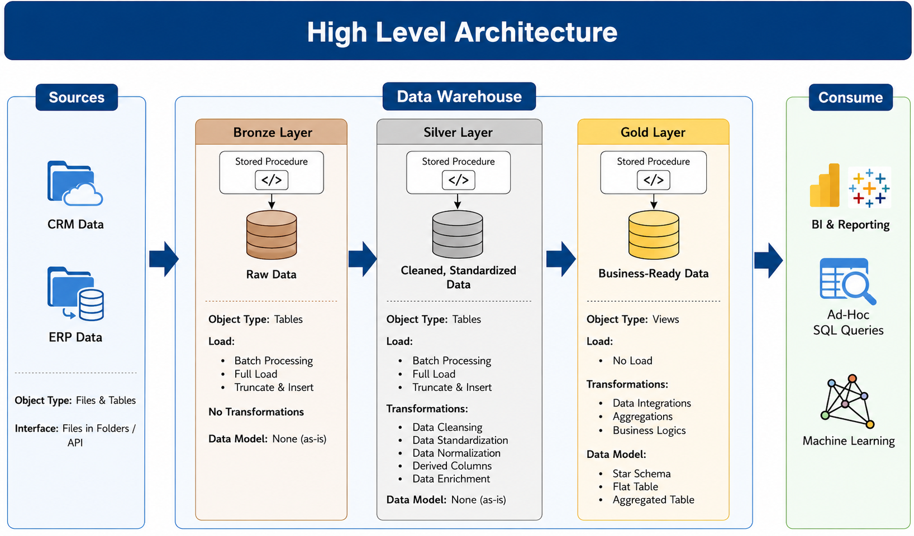
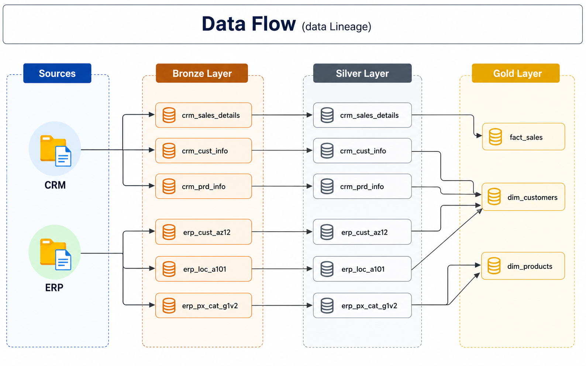
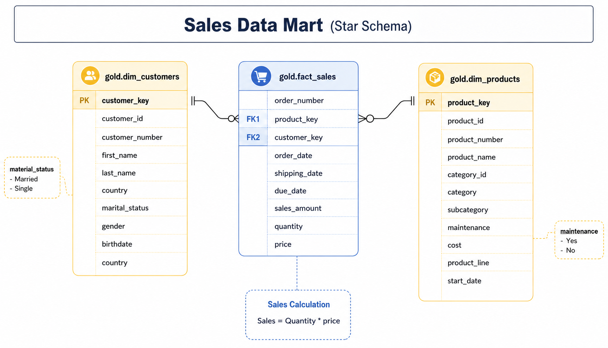

# sql-data-warehouse-project
Building a modern data warehouse using SQL Server with ETL pipelines, data modeling, and analytics solutions.
# 🏗️ SQL Data Warehouse Project

> A hands-on data engineering project where I designed and built a modern data warehouse from scratch using SQL Server covering data ingestion, transformation, modeling, and analytics.

---

## 👨‍💻 About This Project

This project was part of my learning journey as an aspiring Data Engineer. I built a complete data warehousing solution that takes raw business data from two source systems (CRM and ERP), processes it through three architectural layers, and delivers clean, analytics-ready data.

The goal wasn't just to follow along — it was to understand *why* each step matters, and to practice the real skills used by data engineers on the job.

---

## 🏛️ Architecture Overview

This project follows the **Medallion Architecture** a layered approach that keeps data organized, traceable, and progressively refined.



| Layer | What It Contains | Purpose |
|-------|-----------------|---------|
| 🟤 **Bronze** | Raw data as-is from CSV files | Traceability keep original data untouched |
| ⚪ **Silver** | Cleaned and standardized data | Prepare data for reliable analysis |
| 🟡 **Gold** | Business-ready star schema views | Analytics, reporting, and decision-making |

---

## 📊 Data Flow

The data originates from two source systems and flows through each layer:



**Sources:** CRM (3 tables) + ERP (3 tables) → Bronze → Silver → Gold

**Gold Layer Output:**
- `gold.dim_customers` — Customer dimension
- `gold.dim_products` — Product dimension  
- `gold.fact_sales` — Sales fact table (star schema center)

---

## 🔧 What I Built

### 1. Database Initialization
- Created the `DataWarehouse` database with three schemas: `bronze`, `silver`, `gold`

### 2. Bronze Layer — Data Ingestion
- Loaded 6 raw CSV files into SQL tables using `BULK INSERT`
- No transformations applied data stored exactly as received from source systems
- Tables: `crm_sales_details`, `crm_cust_info`, `crm_prd_info`, `erp_cust_az12`, `erp_loc_a101`, `erp_px_cat_g1v2`

### 3. Silver Layer — Data Cleaning & Transformation
- Applied data cleansing: removed duplicates, handled NULLs, fixed data types
- Standardized formats: dates, gender codes, country names
- Added derived columns and enriched records from multiple sources

### 4. Gold Layer — Data Modeling
- Created SQL **Views** (not tables) implementing a star schema
- Joined CRM and ERP data into unified business objects
- Built `dim_customers`, `dim_products`, and `fact_sales`

### 5. Analytics & Reporting
- Wrote SQL queries for customer behavior analysis
- Analyzed product performance and sales trends
- Applied window functions for running totals and rankings

---

## 📁 Repository Structure

```
sql-data-warehouse-project/
│
├── datasets/               ← Source CSV files (CRM + ERP raw data)
│
├── docs/                   ← Architecture diagrams and documentation
│   ├── data_architecture.png
│   ├── data_flow.png
│   ├── data_integration.png
│   ├── data_model.png
│   ├── data_catalog.md     ← Column-level data dictionary
│   └── naming_conventions.md
│
├── scripts/
│   ├── init_database.sql   ← Database and schema setup
│   ├── bronze/             ← Raw data ingestion scripts
│   ├── silver/             ← Cleaning and transformation scripts
│   └── gold/               ← Analytical views (star schema)
│
├── tests/                  ← Data quality validation queries
│
└── README.md
```

---

## 🛠️ Tech Stack

| Tool | Purpose |
|------|---------|
| **SQL Server Express** | Database engine |
| **SSMS** | SQL development environment |
| **T-SQL** | Scripting, ETL, and analytics |
| **Draw.io** | Architecture and data flow diagrams |
| **Git & GitHub** | Version control and portfolio hosting |

---

## 📐 Data Model — Star Schema



The Gold layer is modeled as a **star schema** with one central fact table and two dimension tables:

- `fact_sales` links to `dim_customers` via `customer_key`
- `fact_sales` links to `dim_products` via `product_key`
- Sales amount is calculated as: `quantity × price`

---

## 🔑 Key Concepts Practiced

- **Medallion Architecture** (Bronze / Silver / Gold)
- **ETL Pipeline Design** — Full load with Truncate & Insert pattern
- **Data Cleansing** — Handling NULLs, deduplication, type casting
- **Data Integration** — Joining CRM and ERP systems using surrogate keys
- **Star Schema Modeling** — Fact and dimension tables for analytics
- **SQL Window Functions** — Running totals, rankings, performance comparisons
- **Data Documentation** — Data catalog, naming conventions, lineage diagrams

---

## 📌 Naming Conventions

All objects follow a consistent naming standard see [`docs/naming_conventions.md`](docs/naming_conventions.md) for the full guide.

Quick summary:
- Bronze/Silver tables: `<sourcesystem>_<entity>` (e.g., `crm_cust_info`)
- Gold views: `<category>_<entity>` (e.g., `dim_customers`, `fact_sales`)
- Surrogate keys: `<table>_key` suffix
- Technical columns: `dwh_` prefix

---

## 💡 What I Learned

Building this project taught me how data engineering works end to end. The Bronze layer gave me an appreciation for keeping raw data untouched it's your safety net. The Silver layer is where most of the real work happens, because real-world data is messy. The Gold layer showed me why good modeling makes analysts' lives so much easier.

The biggest lesson: **documentation is not optional**. A well-documented warehouse is what separates a professional project from a code dump.

---

## 🚀 How to Run This Project

**Prerequisites:**
- SQL Server Express (free download)
- SQL Server Management Studio (SSMS)

**Steps:**
1. Clone this repository
2. Open SSMS and connect to your local SQL Server instance
3. Run `scripts/init_database.sql` to create the database and schemas
4. Run scripts in `scripts/bronze/` to load raw data
5. Run scripts in `scripts/silver/` to clean and transform data
6. Run scripts in `scripts/gold/` to create the analytical views
7. Run queries in `tests/` to validate data quality

---

## 📬 Connect With Me

[](https://linkedin.com/in/uzair08)
[](mailto:uzair.akhtar501@gmail.com)
[](https://github.com/HafizUzairAkhtar)
